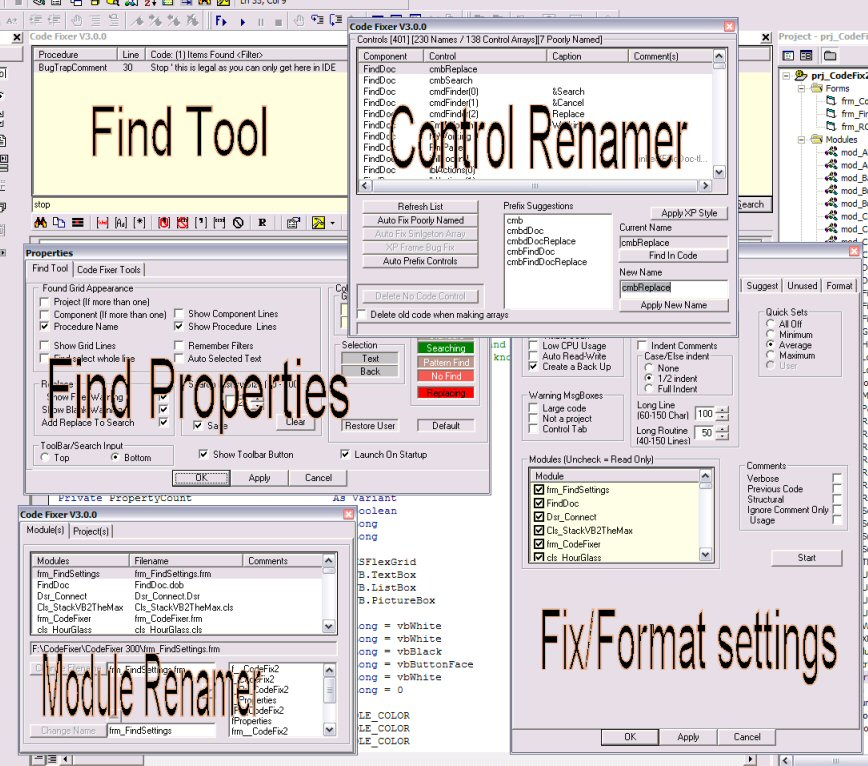



## Code Fixer 3\.0\.9

### Description

This is a VB6 Add-in. It's purpose is to format, optimize and improve VB code.

Many fixes are performed automatically and there are also many additional suggestions to improve your code.

----

It also contains a user-friend replacement for VB's find and replace tool.

----

This is a very powerful tool so please download the separate help file upload and read it for installation and operating instructions.

----

If you have tried it before then it's time to up-date (or give it another go, there may have been a lot of bug fixes and improvements since then).

----

Comments/bug reports welcome. Please contact me if you have any questions.

Re-issued because the version number has rolled over and to gather some new end-user input so suggest away.

----

Updates

3.0.9

FIXED debug Stop left in code, NEW fix Fonts properties in USerControls fix, Release folder has better naming

see history.txt for details and thanks
 
### More Info
 

             |
---                |---
**Submitted On**   |2005-03-12 12:10:32
**By**             |[Roger Gilchrist](https://github.com/Planet-Source-Code/PSCIndex/blob/master/ByAuthor/roger-gilchrist.md)
**Level**          |Advanced
**User Rating**    |5.0 (290 globes from 58 users)
**Compatibility**  |VB 6\.0
**Category**       |[Complete Applications](https://github.com/Planet-Source-Code/PSCIndex/blob/master/ByCategory/complete-applications__1-27.md)
**World**          |[Visual Basic](https://github.com/Planet-Source-Code/PSCIndex/blob/master/ByWorld/visual-basic.md)
**Archive File**   |[Code\_Fixer1867783242005\.zip](https://github.com/Planet-Source-Code/roger-gilchrist-code-fixer-3-0-9__1-59247/archive/master.zip)

